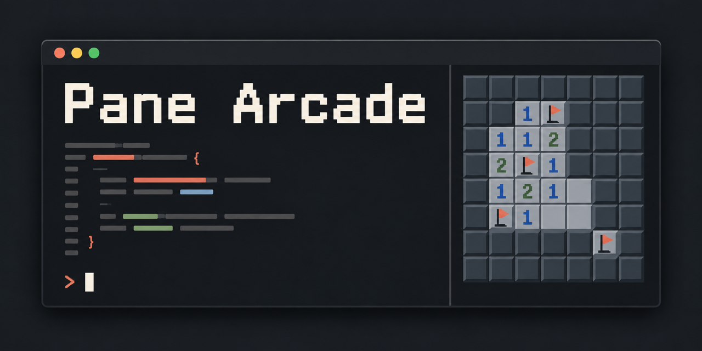
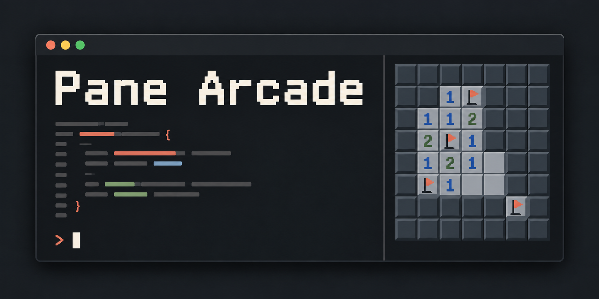

# Pane Arcade 🕹️





**Play games in a pane while Claude Code works.** Snake, Minesweeper, 2048, chess against Stockfish, and a
CHIP-8 emulator with a dozen public-domain games built in, plus any CHIP-8 ROM you bring.

Pane Arcade is a [Claude Code mod](https://claude.dev): a plugin that adds a docked game pane to Claude Code.
Kick off a long task, type `/arcade`, and play until Claude needs you. The pane's header shows
**● Claude is working** while it works, flips to **◆ Claude is waiting for you** when it's done, and a toast
lets you know.

| | |
| --- | --- |
| 🐍 **Snake** | The classic. Speeds up as you grow. |
| 💣 **Minesweeper** | Beginner, Intermediate and Expert boards. Click to reveal, right-click to flag. |
| 🔢 **2048** | Drag or use the arrow keys to slide; undo one move. |
| ♟️ **Chess** | Click or drag pieces. Plays [Stockfish](https://stockfishchess.org) at five strengths, falls back to a built-in engine, or two players at one keyboard. |
| 👾 **CHIP-8** | A full CHIP-8 interpreter with 12 public-domain games (Breakout, Pong, a runner, a cave explorer, ...), on-screen buttons, and each game's own colours. Load your own ROMs too. |

## Install

You need Claude Code with mod support (built and tested on v2.1.287).

In Claude Code, run:

```text
/plugin marketplace add thefotes/pane-arcade
/plugin install arcade@pane-arcade
```

Then switch on the **fullscreen renderer** so the arcade can use your mouse and arrow keys (it restarts and
resumes your session; you only do this once):

```text
/tui fullscreen
```

**Optional, for chess:** install Stockfish so it's on your `PATH`:

```sh
brew install stockfish          # macOS
sudo apt install stockfish      # Debian / Ubuntu
```

Without it, chess still works against the built-in engine and says so.

> **Mods run with the same access to your machine as Claude Code.** Read a mod before you install it. This one
> reads CHIP-8 ROMs (its own, `~/.claude/arcade/roms/`, and files you `/arcade load`) and runs `stockfish` if you
> have it, and nothing else: no network, no other files. It's all in [`hooks/register.tsx`](hooks/register.tsx).

## Play

Type `/arcade` and pick a game. `/arcade` works mid-turn, so you can start a game while Claude is busy.

| Command | |
| --- | --- |
| `/arcade` | Open the menu |
| `/arcade snake` · `minesweeper` · `2048` · `chess` | Jump straight into a game |
| `/arcade chip8 <name>` | Run a CHIP-8 ROM by name, e.g. `/arcade chip8 br8kout` |
| `/arcade load <path>` | Run a CHIP-8 ROM file you supply |
| `/arcade close` | Close the arcade |
| `/arcade help` | Show all of the above |

**Click the game to play.** A click gives the game your mouse and keyboard (arrows included); **Esc** hands the
keys back to Claude and leaves the game where it is. Every game has **‹ menu** and **❚❚ pause** buttons in its
header, or press `backspace` and `p`.

**To quit,** click **✕ close** in the arcade's header (or the pane's own ✕), press `ctrl+x` then `x`, or run
`/arcade close`.

| Game | Mouse | Keyboard |
| --- | --- | --- |
| Snake | | arrows / WASD |
| Minesweeper | click to reveal (or chord a number), right-click to flag | arrows / HJKL move, `space` reveal, `f` flag, `1` `2` `3` board size, `r` restart |
| 2048 | drag in a direction | arrows / WASD / HJKL, `u` undo, `r` restart |
| Chess | click a piece, then its square (or drag it); buttons for new game, undo, swap sides, 2 players, engine level | arrows / WASD + `space`, `u` undo, `n` new, `c` swap sides, `l` level, `t` two players, `g` letter pieces |
| CHIP-8 | press and hold the on-screen buttons | number keys are the keypad's digits, arrows = 5 7 8 9, `space` = 6; the full pad is also on `1234` / `qwer` / `asdf` / `zxcv` |

<details>
<summary>On the classic renderer (no <code>/tui fullscreen</code>)</summary>

Claude Code's classic renderer can't pass a mouse or arrow keys to a mod, so the arcade shows a **play** field under
the game and forwards what you type: letters, digits, space and enter (every game has letter controls). The pane is
shorter there, so the menu scrolls, chess uses a compact board and CHIP-8 draws in braille, 2×4 pixels per
character. It works, but fullscreen is much nicer.
</details>

### Bring your own CHIP-8 ROMs

Run any ROM with `/arcade load ~/Downloads/game.ch8`, or drop `.ch8` files into `~/.claude/arcade/roms/` to list them
in the menu. An optional `roms.json` beside them sets a ROM's title, speed, [Octo](https://johnearnest.github.io/Octo/)
quirk flags, instructions and palette:

```json
{
  "mygame": {
    "title": "My Game",
    "tickrate": 15,
    "quirks": { "shift": false, "loadStore": false, "clip": true },
    "howto": "Keys 7 and 9 move. Key 6 fires.",
    "colors": { "fill": "#ffcc00", "background": "#0000ff" }
  }
}
```

Keys named in `howto` ("keys 7 and 9") become the on-screen buttons. The [Chip8 Community Archive](https://github.com/JohnEarnest/chip8Archive)
has dozens more, all CC0.

## Where the games come from

Everything here is either original or explicitly public domain, so the whole project can be open source:

- **Original code (MIT):** Snake, Minesweeper, 2048, the chess rules and built-in engine, and the CHIP-8
  interpreter. 2048 is Gabriele Cirulli's design, itself MIT licensed; this is a fresh implementation.
- **Stockfish is not bundled.** The arcade runs the copy you installed as a separate program and talks to it over
  UCI, so this project stays MIT while Stockfish's GPL stays with Stockfish.
- **The 12 bundled ROMs** come from the Chip8 Community Archive, which dedicates everything in it to the public
  domain (CC0). Authors and titles are credited in [`roms/CREDITS.md`](roms/CREDITS.md).
- **`/arcade load` runs ROMs you supply.** This project doesn't ship, link to or help find commercial ROMs. CHIP-8
  needs no BIOS; its 80-byte hex font comes from the spec.

## How it works

A mod is a hooks module plus, for interactive UI, a *Client* surface module that runs on Claude Code's drawing
thread:

```
hooks/register.tsx     hooks module: /arcade, the pane, ROM files, Stockfish, Claude's busy state
hooks/client.tsx       Client: menu, keys, mouse, a 60 Hz frame clock, drawing
hooks/games/           the games ("cartridges"): plain TypeScript, no Claude Code imports
  cartridge.ts         the contract every game implements
  snake.ts  minesweeper.ts  g2048.ts  chess/  chip8/
roms/                  CC0 CHIP-8 ROMs, their settings (roms.json) and credits
tests/arcade.test.tsx  engine tests: mount the pane, click and type into it (claude plugin test .)
tests/unit/            game tests (bun test)
```

A cartridge is a plain object with `init`, `key`, an optional `pointer` (mouse) and `tick` (fixed period), and
`view`, which returns lines of styled text. The Client drives it and draws it. A game that needs the machine (chess
asking Stockfish for a move) returns a `pendingRequest`; the Client posts it to the hooks module, and the answer
comes back through `onResponse`.

### Add a game

1. Write a `Cartridge` in `hooks/games/` ([`snake.ts`](hooks/games/snake.ts) is a small example).
2. Add it to [`hooks/games/index.ts`](hooks/games/index.ts).
3. Add tests in `tests/unit/`.

Use Claude Code theme colours (`text`, `inactive`, `success`, ...) for anything drawn on the pane's own background,
so the game reads well in light and dark themes. Pull requests welcome!

## Develop

```sh
git clone https://github.com/thefotes/pane-arcade && cd pane-arcade
bun install
claude --plugin-dir .        # run Claude Code with the mod loaded; saving a file hot-reloads it
bun test tests/unit          # game tests
bun run typecheck            # strict TypeScript (needs one `claude --plugin-dir .` run to lay the engine's types)
claude plugin validate .     # what Claude Code will load
claude plugin test .         # engine tests
```

## Credits

- CHIP-8 games by the authors listed in [`roms/CREDITS.md`](roms/CREDITS.md), via John Earnest's Chip8 Community Archive.
- [Stockfish](https://stockfishchess.org) by the Stockfish developers (not bundled).
- Built with [Claude Code](https://claude.com/claude-code) and [opencode](https://opencode.ai) running a local model.

## License

[MIT](LICENSE), except the bundled ROMs, which are CC0 (see [`roms/CREDITS.md`](roms/CREDITS.md)).

Pane Arcade is an independent community project, not affiliated with or endorsed by Anthropic. Claude and Claude
Code are trademarks of Anthropic.
